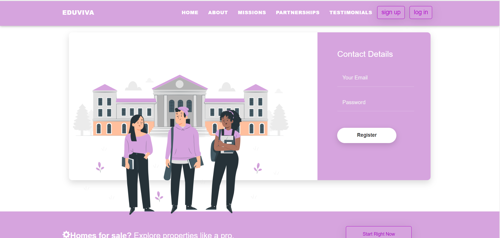

#  Project Name: EduViva

##  Team Members

- Akzoun Hafsa
- El yahyaouy Imane
- Haddad Alae
- Stitou Fatima

## Framed by

- Pr. Achaak Lotfi

## 📜 TABLE OF CONTENTS 

  
🔠Table of Contents

  <ol>
    <li><a href="#overview">Overview</a></li>
    <li><a href="#objectives">Objectives</a></li>
    <li><a href="#project-structure">Project Structure</a></li>
    <li><a href="#description-of-the-web-appcitaion">Description of the web application</a></li>
    <li><a href="#conception">Conception</a></li>
    <li><a href="#tools-used">Tools Used</a></li>
    <li><a href="#security">Security</a></li>
    <li><a href="#live-demo">Live demo</a></li>
    <li><a href="#getting-started">Getting Started</a></li>
    <li><a href="#how-to-run">How to Run</a></li>
    <li><a href="#deliverables">Deliverables</a></li>
    <li><a href="#note">Note</a></li>
  </ol>

## 🌐 Overview

EduViva is a project developed by our team as part of the MST SIBD module at Université Abdelmalek Essaadi. In simple terms, it's like going on a fascinating adventure to create a web application using smart techniques called Service-Oriented Architecture (SOA). We use Python, specifically Flask/FastAPI and Spring Boot, for the behind-the-scenes work (backend), and for the part you see and interact with (frontend), we use Angular to make it look and feel great. We're also careful about security, using jwt, 2auth and following good practices known as DevOps

(<a href="#readme-top">🔠Back to Top</a>)

## 🎯 Objectives

- Channeling the mystical powers of SOA in Python and Java.
- Forging a PWA with Angular for an enchanting frontend.
- Unveiling the secrets of DevOps in our development pipeline.
- Casting protective spells to safeguard the web application.

(<a href="#readme-top">🔠Back to Top</a>)

##  Project Structure

- `/backend`: A mystical realm containing the source code for the backend developed in Spring Boot and Flask/FastAPI.
   - `/EDuVIvaFlask`:containing code source of flask
   - `/EduVivaJwtScurity`:Containing jwt logic 
   - `/EduVivaSpring`: code source of classes ,crud ...
- `/frontend`: An enchanted forest containing the source code for the frontend developed in Angular.
- `/assests`: Containing images of readme file .
- Vedio containing  presentation of the application and its security features

(<a href="#readme-top">🔠Back to Top</a>)

## 📖 Description of the web application

EduViva, our mystical creation, is an all-in-one online platform designed to elevate the student experience. Enriching lives through essential services and charitable contributions, our website is a sanctuary for students to manage their daily affairs.
the web application has 3 interfaces : 

  - **🎓 Student Services:**
      - Registration / Login
      - Welcome Section.
      - List of offers.
      - List of companies.
      - About us.
      - List of services.
        
  - **💰 Fundraising Center:**
      - Registration / Login
      - Get started: creating a company (for the first time, the first company) // new company
          - List of companies.
          - Create company.
          - Edit company.
          - Delete company.

       - Call-to-Action (CTA) Buttons: creating an offer.
          - Choosing an offer category in a certain company.
          - Form adequate to the category => post.
          
       - Manage offers:
          - List of offers.
          - Create offer.
          - Edit offer.
          - Delete offer.
          
  -  **👑 Admin:**
       - Managing services:
          - List of services.
          - Create service.
          - Edit service.
          - Delete service.
          
       - Managing companies and offers: 
          - List of companies.
          - Delete companies.
          - List of offers.
          - Delete offers.

(<a href="#readme-top">🔠Back to Top</a>)

##  Conception
###  Class Diagram:
Classes: 
- User
- Volunteer
- Donor
- Donation
- Receipt
- Student
- Campaign
- Request
- Offer
- Business Owner
- Survey
- Category

(<a href="#readme-top">🔠Back to Top</a>)

## 🛠️ Tools Used

- **Backend:**
  - Spring Boot : most of backend made with Spring Spring Boot  framework and represented mainly as RESTful web service.
    
     Used:
    - Spring Web Services
    - Spring Data MongoDB
    - Spring Security

   Security part works with JSON Web Tokens integration and mainly made for admin menu usage.
   All of these parts wrapped with Spring Boot, which include embeded web container in Tomcat implementation.
  - Python: (Flask or FastAPI) => crafting RESTful APIs
    
- **frontend:** Angular: Crafting a responsive and dynamic UI, it is actually independent single page application . What was used:
    - Webpack with number of plugins
    - Angular 15
    - HTML/CSS/SASS

  - `ng generate component component-name`
  - `ng generate service service-name`
  - `ng generate module module-name`
  - `ng serve`
- **Database:** MongoDB: NoSQL 
- **🔍 Monitoring** Integrating mystical tools (e.g., Prometheus, Grafana, Postman) to track app performance.
  - Spring Security and JWT Auth: Safeguarding the exchange between frontend and backend.
  - WTForms: Crafting secure forms and validating user-entered data.

(<a href="#readme-top">🔠Back to Top</a>)

## 🔒 Security 
### Spring Boot 3.0 Security with JWT Implementation
This project unfolds the epic tale of security using Spring Boot 3.0 and the enchanted JSON Web Tokens (JWT). Witness the following magical features:

#### Features
* User registration and login with JWT authentication
* Password encryption using BCrypt
* Role-based authorization with Spring Security
* Customized access denied handling
* Logout mechanism
* Refresh token

#### Technologies
* Spring Boot 3.0
* Spring Security
* JSON Web Tokens (JWT)
* BCrypt
* Maven

(<a href="#readme-top">🔠Back to Top</a>)

## Live Demo
### Home page 

(<a href="#readme-top">🔠Back to Top</a>)

  
 

### Sing UP

 
After choosing the registration form, the user is presented with the corresponding registration form based on their selection.

(<a href="#readme-top">🔠Back to Top</a>)

 
 

### Login
After a successful login, our system dynamically checks the user's assigned roles and permissions. Based on the user's role, specific functionalities and features are made available

(<a href="#readme-top">🔠Back to Top</a>)

 
 

### Admin 
the admin can mange  companies , servies :

 

(<a href="#readme-top">🔠Back to Top</a>)

 
 

### Fundraiser 
Upon logging in as a fundraiser, the initial landing page encountered by the user is the home page, providing a dedicated and tailored starting point for their fundraising activities.

 

the fundraiser can mange  companies and offres :

- companies

 

 
- offers 
 
 
(<a href="#readme-top">🔠Back to Top</a>)

 
 

### Students Interface
Following the student's login, they are presented with a comprehensive view of all available offers, facilitating easy access and exploration of the various opportunities offered on the platform.

(<a href="#readme-top">🔠Back to Top</a>)

### Profile management

(<a href="#readme-top">🔠Back to Top</a>)

 

### database

(<a href="#readme-top">🔠Back to Top</a>)

## Getting Started
To get started with this project, you will need to have the following installed on your local machine:

* JDK 17+
* Maven 3+
* Flask
* Angular 15
  - npm install -g @angular/cli@11

* Mongodb 

## ▶️ How to Run

- Run Angular: `ng serve`
- Run Spring
- Run Flask
- Run Mongodb , create databse : EduVivaDB

(<a href="#readme-top">🔠Back to Top</a>)

##  Deliverables

- Codebase hosted on GitHub.
- 3-minute video presentation in `/assests` folder.

(<a href="#readme-top">🔠Back to Top</a>)

## 📝 Note

This project is a collaborative masterpiece crafted by 4 exceptional team members and is part of the MST SIBD module at Université Abdelmalek Essaadi. May the code be ever in your favor!